  

  

  
  
  
  

---

## About

I lead a team at BCG X that builds production ML systems, data platforms, and full-stack AI applications. Most of my work ships through private enterprise repos, so the public ones here are a deliberate sample: structured curricula, multi-agent architectures, entity resolution on messy real-world data, and a research program on fractal structure in indexes, governance, and markets.

Previously built data platforms at Vanguard across six years of cloud consulting. PhD research focuses on data governance and institutional theory, with empirical work on topological signatures in real lineage graphs.

I write a lot of documentation (200K+ words across projects) because the gap between *it works* and *someone else can maintain it* is where most engineering orgs fail.

**Right now:** instrumenting governance regimes. Chapter 13 of the curriculum turns decoupling between formal policy and operational practice into something you can measure, and the roadmap (chapters 15-18) extends that into orchestration, data contracts, lakehouse internals, and governance telemetry.

---

## Seven Labs That Run in Your Browser

No install, no notebook server. Each one makes a hard idea visible at the speed of a click.

| Lab | One hard idea, made visible |
|---|---|
| [Indexing Studio](https://mhdk1602.github.io/python_training/indexing-studio.html) | Watch a Hilbert curve fill a 32×32 grid, then see why Iceberg adopted it in 2025. |
| [Orchestration Studio](https://mhdk1602.github.io/python_training/orchestration-studio.html) | Materialize an asset graph in dependency order, then watch a failure's blast radius spread. |
| [Governance Studio](https://mhdk1602.github.io/python_training/governance-studio.html) | Sketch a multi-scale pressure field and watch translation drift compound from regulator to practitioner. |
| [Fractal Graphs](https://mhdk1602.github.io/python_training/fractal-graphs.html) | A time series is a graph in disguise. So is a lineage DAG. |
| [Fractal Studio](https://mhdk1602.github.io/python_training/fractals-governance.html) | Mandelbrot, box-counting, and duplicate-cluster stewardship in one surface. |
| [Ranking Lab](https://mhdk1602.github.io/python_training/ranking-lab.html) | Hybrid search and reranking scored with MRR and NDCG. |
| [Embeddings Bridge](https://mhdk1602.github.io/python_training/embeddings-bridge.html) | From raw text to vectors to grounded retrieval, traced step by step. |

---

## Featured Engineering

| Repo | What it is | Stack |
|---|---|---|
| [`python_training`](https://github.com/mhdk1602/python_training) | Cumulative DE curriculum: 84 notebooks across 17 chapters, a full-stack trading platform, a retrieval lab with citations, and the seven browser labs above. [Live site](https://mhdk1602.github.io/python_training/). |      |
| [`galatiq-invoice-processing`](https://github.com/mhdk1602/galatiq-invoice-processing) | Multi-agent invoice pipeline: extraction, validation, approval, payment with rule-based fallback. |     |
| [`cursor-hud-themes`](https://github.com/mhdk1602/cursor-hud-themes) | Sci-fi HUD themes for Cursor and VS Code: JARVIS holographic wireframes, neon dragon magenta, arc reactor watermarks, animated borders. |   |

## Featured Research

Each project below ships a paper or pre-registration archived on Zenodo with a permanent DOI.

| Repo | Result | Artifact |
|---|---|---|
| [`multiscale-governance-descriptors`](https://github.com/mhdk1602/multiscale-governance-descriptors) | Topological features distinguish curated core assets in DLG-DG-23 with mean LR AUC `0.897 +/- 0.099` (random baseline `0.546`). |  |
| [`fractal-pv-coupling`](https://github.com/mhdk1602/fractal-pv-coupling) | Temporal coupling between price volatility and trading volume strong in 49/50 S&P 500 equities (mean `r = 0.665`); CII predicts illiquidity. |  |
| [`hurst-aware-partitioning`](https://github.com/mhdk1602/hurst-aware-partitioning) | Pre-registered benchmark of Hurst-aware chunk-boundary partitioning against TimescaleDB-style and CUSUM baselines on long-range-dependent series. |  |
| [`fractal-ann-diagnostics`](https://github.com/mhdk1602/fractal-ann-diagnostics) | Intrinsic-dimension descriptors (D2, LID, multifractal width, hubness) that predict ANN index failure modes before tuning. | v0.1.0 in development |
| [`fractal-indexing-viz`](https://github.com/mhdk1602/fractal-indexing-viz) | Streamlit views: Hilbert + D2 heatmap, HNSW layers coloured by LID, streaming MFDFA, box-counting walk-through. | companion to the indexing program |
| [`fractal-pv-dashboard`](https://github.com/mhdk1602/fractal-pv-dashboard) | Interactive explorer for the price-volume coupling paper. |  |

**Looking for collaborators** on governance-graph descriptors, fractal indexing benchmarks, and replications of the pre-registered studies. The fastest way to reach me is [LinkedIn](https://www.linkedin.com/in/dinesh-m-039533189/); the fastest way to start is an issue on the relevant repo.

---

## Tech Stack

  

  

  
  
  
  
  
  
  
  
  
  
  

---

<b>What I build at work (private repos)</b>

 

| Project | What it does | Stack |
|---|---|---|
| **CV Pricing Recommender** | ML pricing recommendations served to consultants in production via ClientView. | scikit-learn, FastAPI, React, Azure, Snowflake |
| **Enterprise Data Platform** | Founding architect. 1,100+ commits. 90+ internal docs. | dbt, Snowflake, Python, Kubernetes, Vault |
| **DE Training Curriculum** | 50+ notebooks teaching data engineering through GenAI. | Jupyter, Flask, PostgreSQL, Hasura, Next.js, Claude |
| **Multi-Agent Invoice Processing** | 4-stage LLM pipeline with rule-based fallback. | FastAPI, xAI Grok, SQLite, Pydantic |
| **Healthcare Entity Resolution** | Fuzzy + embedding-based facility matching across databases. | BERT, RoBERTa, GPT-3, spaCy, Annoy |

---

## GitHub Signal

  

  <i>Most of my commits live in enterprise repos. Public stats above reflect personal and open-source work only.</i>

