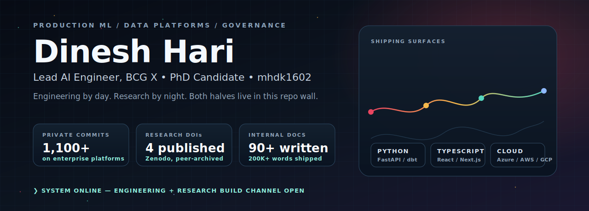
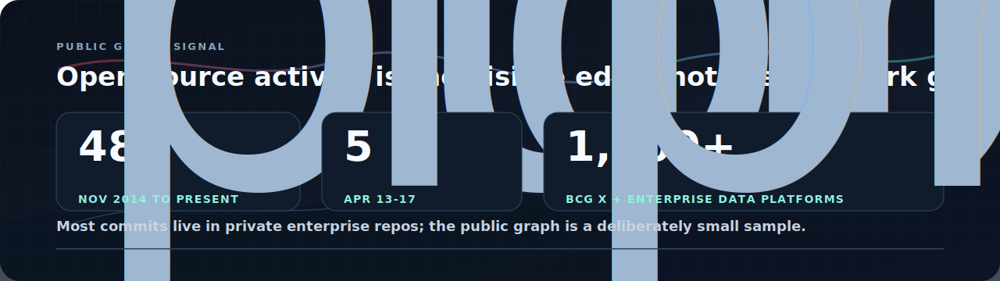

  

  <strong>Production ML systems</strong> · <strong>data platforms</strong> · <strong>multi-agent AI</strong> · <strong>full-stack engineering</strong> · <strong>governance research</strong>

  
  
  

---

## About

I lead a team at BCG X that builds production ML systems, data platforms, and full-stack AI applications. Most of my work ships through private enterprise repos, so the public ones here are a deliberate sample: structured curricula, multi-agent architectures, entity resolution on messy real-world data, and a research program on fractal structure in indexes, governance, and markets.

Previously built data platforms at Vanguard across six years of cloud consulting. PhD research focuses on data governance and institutional theory, with empirical work on topological signatures in real lineage graphs.

I write a lot of documentation (200K+ words across projects) because the gap between *it works* and *someone else can maintain it* is where most engineering orgs fail.

---

## Featured Engineering

| Repo | What it is | Stack |
|---|---|---|
| [`python_training`](https://github.com/mhdk1602/python_training) | Cumulative DE curriculum: notebook spine, full-stack trading platform, retrieval lab with citations, plus four advanced studios on fractals, governance, indexing, and graphs. |      |
| [`galatiq-invoice-processing`](https://github.com/mhdk1602/galatiq-invoice-processing) | Multi-agent invoice pipeline: extraction, validation, approval, payment with rule-based fallback. |     |
| [`cursor-hud-themes`](https://github.com/mhdk1602/cursor-hud-themes) | Sci-fi HUD themes for Cursor and VS Code: JARVIS holographic wireframes, neon dragon magenta, arc reactor watermarks, animated borders. |   |

## Featured Research

Each project below ships a paper or pre-registration archived on Zenodo with a permanent DOI.

| Repo | Result | Artifact |
|---|---|---|
| [`multiscale-governance-descriptors`](https://github.com/mhdk1602/multiscale-governance-descriptors) | Topological features distinguish curated core assets in DLG-DG-23 with mean LR AUC `0.897 +/- 0.099` (random baseline `0.546`). |  |
| [`fractal-pv-coupling`](https://github.com/mhdk1602/fractal-pv-coupling) | Temporal coupling between price volatility and trading volume strong in 49/50 S&P 500 equities (mean `r = 0.665`); CII predicts illiquidity. |  |
| [`hurst-aware-partitioning`](https://github.com/mhdk1602/hurst-aware-partitioning) | Pre-registered benchmark of Hurst-aware chunk-boundary partitioning against TimescaleDB-style and CUSUM baselines on long-range-dependent series. |  |
| [`fractal-ann-diagnostics`](https://github.com/mhdk1602/fractal-ann-diagnostics) | Intrinsic-dimension descriptors (D2, LID, multifractal width, hubness) that predict ANN index failure modes before tuning. | scaffold &#8212; v0.1.0 pending |
| [`fractal-indexing-viz`](https://github.com/mhdk1602/fractal-indexing-viz) | Streamlit views: Hilbert + D2 heatmap, HNSW layers coloured by LID, streaming MFDFA, box-counting walk-through. |  |
| [`fractal-pv-dashboard`](https://github.com/mhdk1602/fractal-pv-dashboard) | Interactive explorer for the price-volume coupling paper (live deployment). |  |

---

## Tech Stack

  

  

  
  
  
  
  
  
  
  
  
  
  

---

<b>What I build at work (private repos)</b>

 

| Project | What it does | Stack |
|---|---|---|
| **CV Pricing Recommender** | ML pricing recommendations served to consultants in production via ClientView. | scikit-learn, FastAPI, React, Azure, Snowflake |
| **Enterprise Data Platform** | Founding architect. 1,100+ commits. 90+ internal docs. | dbt, Snowflake, Python, Kubernetes, Vault |
| **DE Training Curriculum** | 50+ notebooks teaching data engineering through GenAI. | Jupyter, Flask, PostgreSQL, Hasura, Next.js, Claude |
| **Multi-Agent Invoice Processing** | 4-stage LLM pipeline with rule-based fallback. | FastAPI, xAI Grok, SQLite, Pydantic |
| **Healthcare Entity Resolution** | Fuzzy + embedding-based facility matching across databases. | BERT, RoBERTa, GPT-3, spaCy, Annoy |

---

## GitHub Signal

  

  <i>Most of my commits live in enterprise repos. Public stats above reflect personal and open-source work only.</i>

